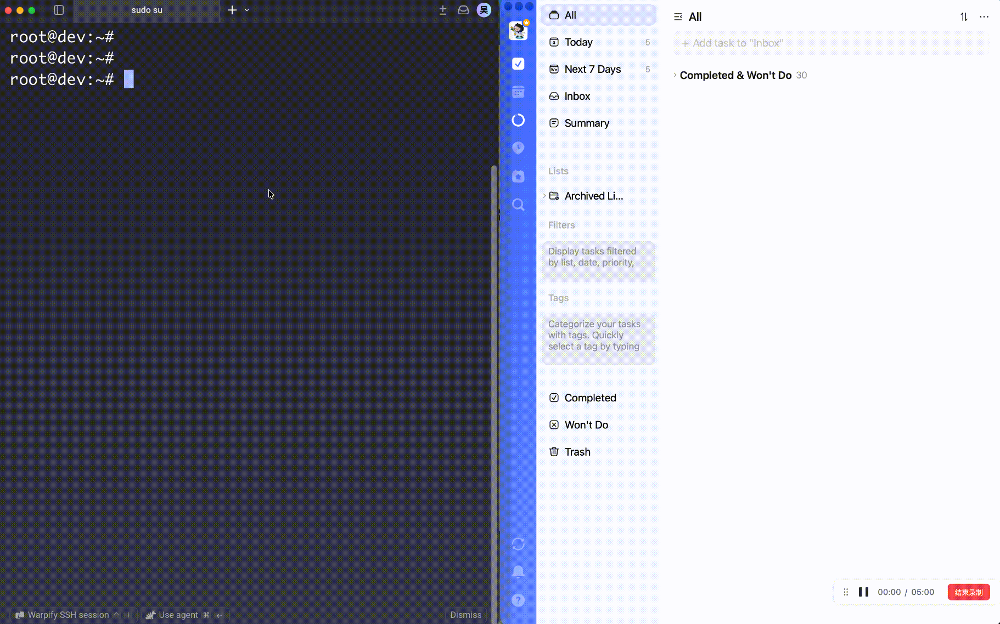

# tick - TickTick/Dida365 CLI

**中文** | [English](README.en.md)

[](https://github.com/JeelyWu/ticktick-cli/actions/workflows/unit-tests.yml)
[](LICENSE)



`tick` 是一个非官方的 Go CLI，通过官方 Open API 操作 TickTick 国际版和滴答清单（Dida365）。它把快速录入任务、项目管理、习惯、专注记录和可脚本化输出带到终端里。

## 为什么用 tick？

- 在终端里用紧凑的 quick-add 语法快速记录任务。
- 用一个二进制文件管理 TickTick/滴答清单的项目、任务、习惯和专注记录。
- 面向人类使用表格输出，面向脚本、启动器和自动化使用 JSON 输出。
- 使用交互式 OAuth 登录，本地环境可自动捕获 localhost 回调。
- 通过本地默认配置在 TickTick 国际版和滴答清单中国大陆版之间切换。

## 安装

### GitHub Releases

从 [GitHub Releases](https://github.com/JeelyWu/ticktick-cli/releases) 下载对应平台的压缩包，解压后将可执行文件放入 `PATH`。

```bash
# Linux / macOS 示例
tar -xzf tick_0.0.1_linux_amd64.tar.gz
install -m 0755 tick /usr/local/bin/tick
```

### 安装脚本（macOS / Linux）

```bash
curl -fsSL https://raw.githubusercontent.com/JeelyWu/ticktick-cli/master/scripts/install.sh | bash
```

### Go install

```bash
go install github.com/jeelywu/ticktick-cli/cmd/tick@latest
```

### 从源码构建

```bash
make build
```

生成的二进制文件在 `bin/tick`。

## 快速开始

### 1. 创建开发者应用

- TickTick 国际版：`https://developer.ticktick.com/manage`
- 滴答清单中国大陆版：`https://developer.dida365.com/manage`

记下 **Client ID** 和 **Client Secret**。

### 2. 登录

```bash
tick auth login
```

启动交互式 OAuth 流程，会依次提示：

- 服务区域（`ticktick` 或 `dida365`）
- Client ID
- Client Secret

本地机器会自动捕获回调；远程或 SSH 环境下会退回到手动粘贴回调 URL。

### 3. 验证

```bash
tick auth status
```

## 用法

使用 `tick <command> --help` 查看任意命令的详细说明。

### 项目

```bash
tick project ls
tick project get Work
tick project add Work
tick project add Notes --kind NOTE
tick project update Work --name "New Name"
tick project rm Work --yes
```

### 任务

```bash
# 查询
tick task ls
tick task ls --project Work
tick task ls --today
tick task ls --overdue
tick task ls --status completed
tick task ls --priority 5
tick task ls --from 2026-04-01 --to 2026-04-30
tick task ls --tag urgent

# 查看 / 创建 / 更新 / 删除
tick task get "Write spec"
tick task add "Write spec" --project Work --due 2026-04-20
tick task add "Review" --project Work --due 2026-04-20 --all-day
tick task update "Write spec" --title "Write detailed spec" --due 2026-04-21
tick task done "Write spec"
tick task reopen "Write spec"
tick task rm "Write spec"          # 交互式确认
tick task rm "Write spec" --yes    # 跳过确认

# 移动
tick task move "Write spec" --to Personal
tick task move "Write spec" --project Work --to Personal
```

### 今日任务

```bash
tick today
tick today --json
```

### Quick add

`tick quick add` 支持紧凑的快速录入语法：

- 纯文本 → 任务标题
- `#ProjectName` → 项目
- `!1`、`!3`、`!5` → 优先级
- `^YYYY-MM-DD` → 截止日期

```bash
tick quick add "Write spec #Work !5 ^2026-04-10"
tick quick add "Buy milk #Personal ^2026-04-18"
```

如果已配置 `default_project`，可以省略 `#ProjectName`：

```bash
tick config set default_project Work
tick quick add "Prepare launch notes !3 ^2026-04-22"
```

### 习惯

```bash
tick habit ls
tick habit get "Read 30 min"
tick habit add "Read 30 min" --goal 30 --unit "min"
tick habit update "Read 30 min" --goal 60
tick habit archive "Read 30 min"
tick habit checkin "Read 30 min" --value 30
tick habit log "Read 30 min"
```

### 专注记录

```bash
tick focus ls
tick focus ls --type 0                    # 番茄钟（默认：1=正计时）
tick focus get <focus-id>
tick focus get <focus-id> --type 0        # 番茄钟（默认：1=正计时）
```

### 配置

```bash
tick config list
tick config get region
tick config set region ticktick      # 或 dida365
tick config set output json          # 默认输出格式
tick config set default_project Work # quick add / task add 的默认项目
```

切换区域后需要重新登录：

```bash
tick auth logout
tick auth login
```

### 输出格式与优先级

- 输出格式：`table`（默认）或 `json`。可用 `--json` 或 `tick config set output json` 设置。
- 优先级：`0` 无、`1` 低、`3` 中、`5` 高。

## 免责声明

`tick` 是独立的非官方社区项目，与 TickTick、Dida365 或 Appest 没有关联，也未获得其背书或赞助。

## License

[MIT](LICENSE)
